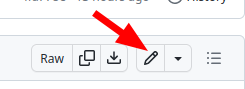
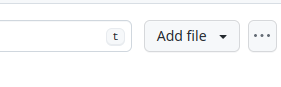

# How to use the Github web interface

```{admonition} In this page, we try out Github

Think about:
* Does this do something we need?
* Is it esay enough to use?
* Is it teachable?
```

## View history of a single page

* Click the `Edit on GitHub` button, then find `History` from there. [example](https://github.com/rkdarst/github-for-collaboration/commits/main/content/how-to-edit.md)
* Try clicking `Blame` (left side, down a bit).  This is not a good
  term, but shows exactly when each part was changed. [example](https://github.com/AaltoSciComp/scicomp-docs/blame/master/triton/tut/array.rst)
* Click `Code` or `<>` to see the raw source.  This is what it looks like
  "under the hood".  [example](https://github.com/rkdarst/github-for-collaboration/blob/main/content/how-to-edit.md?plain=1)

Most of these buttons found here:


## Edit an existing page

* From the `Edit on GitHub` link, click the ✏ pencil icon above the text
  (right side, slightly down the page).
  
* Copy some syntax that you can already see, if you want something.
* Don't worry about making mistakes: it might look weird, you can
  check and see, and try again / ask someone else to take a look.
* What if you aren't sure you got it right?  You can take the same
  option as "outside your organization" and make a pull request - then
  no changes until reviewed and approved!
* Click `Commit Changes`
  * First line: rough summary
  * Extended descritpion: if you want, usually goes about why


### The syntax?
* This is the **Markdown** that we talked about before:
* <https://www.markdown-cheatsheet.com/>
* You can try it out at [the myst-tools sandbox: myst-tools.org/sandbox](https://myst-tools.org/sandbox)

Examples:
* **bold**, **italics**, [link](https://aalto.fi)
* ``**bold**, **italics**, [link](https://aalto.fi)``


## Create a new page

* First go to the site repository (click `Edit on GitHub` on some
  random page).
* In the file path, (`github-for-collaboration/content/test-page.md`),
  click `content`.  This shows the view of all pages.
  
* On the right side, a bit down, you can "create new file"
* I'd recommend copying the basic structure of an existing file.


## Someone outside your organization: edit a page

* All the same steps as above.
* It won't let them make a page.  Instead, it will offer to "fork this
  repository and create a pull request".


## Review a change someone else submitted

* In the repository, click the `Pull Requests` tab.  This shows what
  everyone has done.
* Examine it
  * The title and description
  * There is a whole conversation below that
  * Anyone can add comments to the discussion.
  * "Files changed" shows exactly what was changed
  * "Checks" can validate that the syntax is correct.


## What else?

```{admonition} Questions?

* Any questions from the audience?
* Was this easy enough for simple things?
* Are the features worth learning something better enough to do this
more easily?
```
