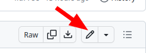
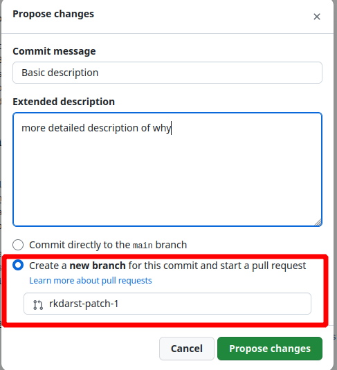

# Edit an existing page

## Background

* Once you can find a file, you can make an edit to it.
* You edit and are prompted to save (you'll give a commit message)
* What format is the file?  Well, that depends.  I'd recommend copying
  something that already works!

## How to

* Find the right page, for example via the `Edit on GitHub` link if
  there is one
* Click the ✏ pencil icon above the text
  (right side, slightly down the page).
  
* Copy some syntax that you can already see, if you want something.
* Don't worry about making mistakes: it might look weird, you can
  check and see, and try again / ask someone else to take a look.
* What if you aren't sure you got it right?  You can take the same
  option as "outside your organization" and make a pull request - then
  no changes until reviewed and approved!
* Click `Commit Changes`
  * First line: rough summary
  * Extended descritpion: if you want, usually goes about why

## Someone outside your organization?

* All the same steps as above.
* It won't let them make a page.  Instead, it will offer to "fork this
  repository and create a pull request".
* Then, this becomes a change proposal ("pull request").  It is *not*
  automatically done but made available for review.

## The syntax?
* This is the **Markdown** that we talked about before:
* <https://www.markdown-cheatsheet.com/>
* You can try it out at [the myst-tools sandbox: myst-tools.org/sandbox](https://myst-tools.org/sandbox)

Examples:
* **bold**, **italics**, [link](https://aalto.fi)
* ``**bold**, **italics**, [link](https://aalto.fi)``
